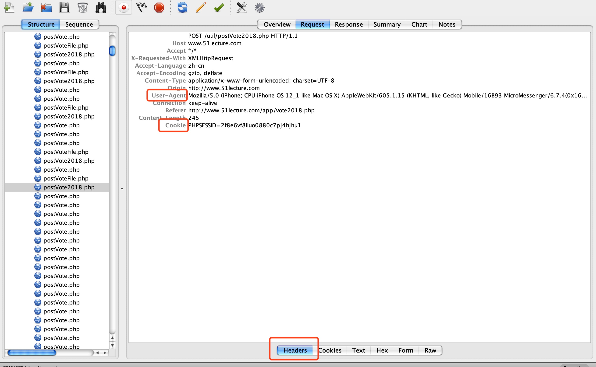
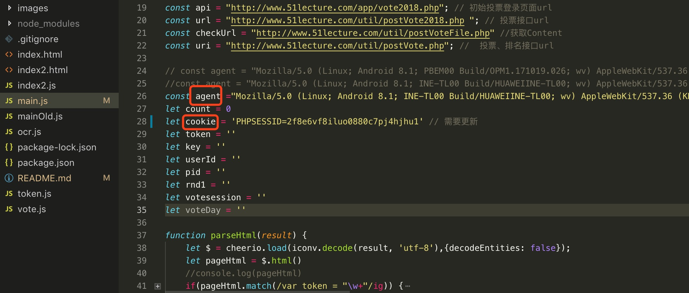

# vote
## 适用场景：
投票。
## 使用方法：
  * 本地安装node([官网下载地址](https://nodejs.org/en/download/))、vscode
  * 复制代码或克隆代码到本地``` git clone https://github.com/ljfedsq/vote.git ``` 
  * 在当前文件夹终端``` npm install ```安装依赖
  * 在手机客户端（抓包精灵、抓包神器等）或电脑（Charles、Fiddler、WireShark）中安装抓包软件，打开微信访问投票页，抓取经微信认证好的cookie，以及手机参数user-agent，如图：



  * 更新代码main.js中的cookie和agent，并保存。如图：



  * 执行```node main.js```
  * 按ctrl+C停止运行

## 声明
  * 对于有特殊需求的可以自己修改代码或者咨询我。